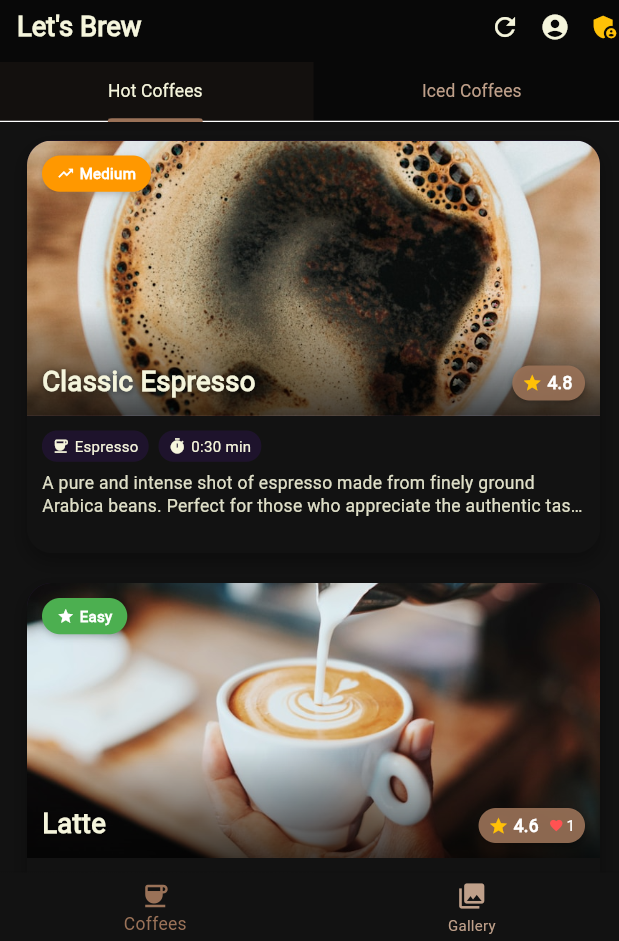

# Let's Brew ☕

A beautiful Flutter application for coffee enthusiasts to discover, learn about, and brew different types of coffee. This app provides detailed information on various coffee types, brewing methods, and allows users to track their brewing progress with interactive timers.


## Features

- **Coffee Catalog**: Browse through a comprehensive collection of hot and iced coffee types
- **Detailed Coffee Profiles**: Each coffee includes:
  - Ingredients list
  - Difficulty level
  - Brew time
  - User ratings
  - Step-by-step brewing instructions
- **Interactive Brewing Timer**: Follow along with timed brewing steps
- **User Profiles**: Create accounts and save favorite coffees
- **Rating System**: Rate and like coffee recipes
- **Admin Dashboard**: Manage coffee listings (for admin users)
- **Beautiful UI**: Modern, elegant dark-themed interface optimized for coffee enthusiasts

## Technologies Used

- **Framework**: Flutter
- **State Management**: Provider
- **Backend & Auth**: Firebase (Firestore, Authentication)
- **Image Hosting**: Unsplash API integration
- **Animation**: Custom Hero animations
- **UI Components**: Custom-built widgets
- **Platforms**: Android, iOS

## Prerequisites

- Flutter 2.10.0 or higher
- Dart SDK 2.16.0 or higher
- Android Studio / VS Code
- Firebase account (for backend functionality)

## Setup Instructions

1. **Clone the repository**
   ```bash
   git clone https://github.com/marginankola/lets_brew.git
   cd lets_brew
   ```

2. **Install dependencies**
   ```bash
   flutter pub get
   ```

3. **Configure Firebase**
   - Create a new Firebase project
   - Add Android & iOS apps to your Firebase project
   - Download `google-services.json` (Android) and `GoogleService-Info.plist` (iOS)
   - Place these files in appropriate directories:
     - `android/app/` for `google-services.json`
     - `ios/Runner/` for `GoogleService-Info.plist`
   - Create a `lib/firebase_options.dart` file (You can use FlutterFire CLI)

4. **API Keys Configuration**
   - Create `lib/constants/api_keys.dart` with your API keys:
   ```dart
   class ApiKeys {
     static const String unsplashApiKey = 'YOUR_UNSPLASH_API_KEY';
   }
   ```

5. **Run the app**
   ```bash
   flutter run
   ```

## Project Structure

```
lib/
  ├── constants/       # App constants (colors, themes, etc.)
  ├── models/          # Data models
  ├── screens/         # App screens
  │   └── admin/       # Admin-specific screens
  ├── services/        # Services for API, Firebase, etc.
  ├── utils/           # Utility functions
  ├── widgets/         # Reusable UI components
  └── main.dart        # App entry point
```

## How to Use

1. **Browse Coffee**: Explore hot and iced coffee options from the home screen
2. **View Details**: Tap on any coffee card to view detailed information and brewing instructions
3. **Start Brewing**: Hit the "Start Brewing" button to activate the brewing timer
4. **Follow Steps**: Follow the step-by-step brewing instructions with timers
5. **Rate & Save**: Rate coffees and save favorites to your profile
6. **Admin Features**: Admin users can manage coffee entries through the admin dashboard

## Screenshots

### 🏠 Home Screen


### 📋 Coffee Details


### ⏱️ Brewing Timer


## Contributing

1. Fork the Project
2. Create your Feature Branch (`git checkout -b feature/AmazingFeature`)
3. Commit your Changes (`git commit -m 'Add some AmazingFeature'`)
4. Push to the Branch (`git push origin feature/AmazingFeature`)
5. Open a Pull Request

## Author

**Margin Ankola** - [GitHub Profile](https://github.com/marginankola)


## Acknowledgements

- Coffee images from [Unsplash](https://unsplash.com/)
- Icons from [Material Design Icons](https://material.io/resources/icons/)
